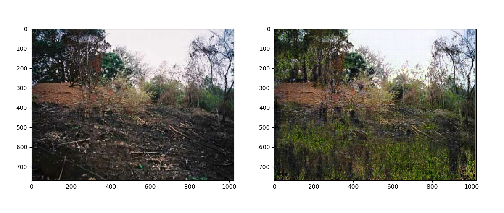
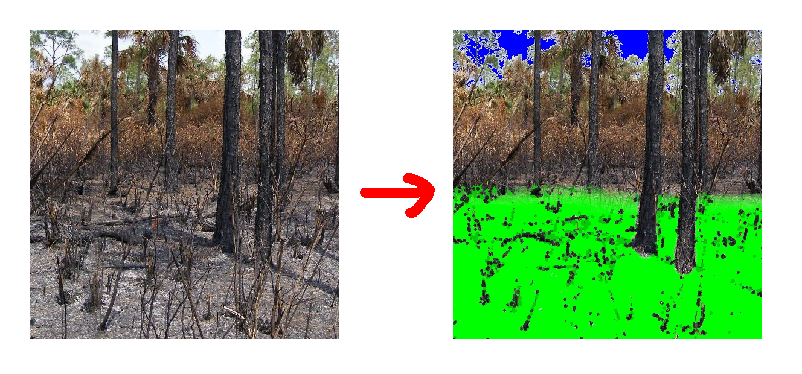
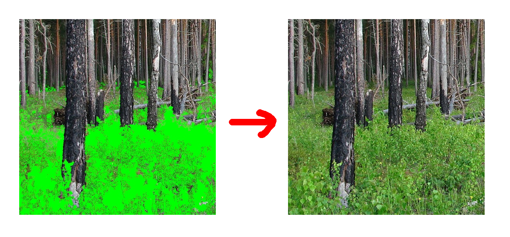
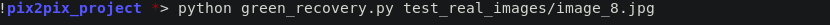

# Green Recovery
_Buenas, En este proyecto lo que se quiere lograr es, dada una imagen de un bosque o una sabana despues de un incendio en el que solo quedan cenizas y carbon, generar una imagen en el que se muestre como se vería tras algun tiempo de recuperacion, pero la imagen de salida será de 786x1024 utilizando al arquitectura pix2pix._

  
 
  <br>[Origen de la imagen](https://www.fws.gov/refuge/Florida_Panther/what_we_do/prescribed_burning.html)
 
[Pix2pix](https://arxiv.org/pdf/1611.07004.pdf) es una arquitectura de red neuronal en forma de reloj de arena que toma como input una imagen y como output otra imagen. En este caso implementada en python.

## 1. ¿Cómo funciona?
Bueno como he mencionado antes nuestro objetivo es generar una imagen de un bosque recuperado de un incendio y que la imagen tenga una resolución de 768x1024. 

Por lo cual nos enfrentamos a los siguientes problemas.
#### 1.1. Conseguir el dataset es imposible.
Como nuestro tarea generar una imagen de un bosque recuperado de un incendio, por lo que necesitariamos imagenes de bosques o areas verdes quemadas y sus versiones en las que pasado un tiempo se hayan recuperado.

Para conseguir este dataset se tendria que esperar por un incendio, tomar fotos, esperar a que se recupere y volver a sacar la foto exactamente desde el mismo angulo y en internet tampoco habia este tipo de fotos o almenos no adecuadas para el entrenamiento de la red neuronal.

Para solocionar este problema inspirado en como el creador de DeepNude resolvió un problema similar con el dataset.

El problema se divide en dos sub-problemas:
- Generar una mascara que seleciones la areas quemadas (carbón y ceniza)

- Generar la imagen de salida a partir de las imagenes enmascaradas.


Nuestro dataset se transforma en dos sub-datasets:
- input_images_a, output_images_a -> imagenes de lugares quemados y sus mascaras.
- input_images_b, output_images_b -> imagenes enmascaradas y la salida deseada.

para facilitar el enmascarado de forma manual para el dataset se utilizó imagenes de muy alta resolucion e imagenes panoramicas para luego recortarlas en varias imagenes pequeñas.

De esta forma no hay necesidad de que el input y el output de no sean iguales.

#### 1.2. Pix2Pix es muy pequeña pero muy densa.
La arquitectura pix2pix genera imagenes de 256x256 y en el problema original las salidas deben de ser de 768x1024. (se podria usar pix2pixHD pero tardaria mas en entrenarse por su tamaño, ademas que mis conocimientos son algo limitados).

Pues, la solucion es algo simple, como si fuese una convolucion, la red neuronal vá barriendo toda la imagen generando de trozo a trozo la imagen deseada. ¿Cómo funciona esto?, la red neuronal recorre la imagen saltando un cierto intervalo de pixeles calculado según el tamaño original de la imagen, el proceso es algo lento pero es ligero.


## 2. Pre-requisitos
_La aplicacion depende de las siguientes librerias_
```
 - tensorflow 2.0 https://www.tensorflow.org/install
 - numpy          https://numpy.org/
 - matplotlib     https://matplotlib.org/
```
Puede instalar todas estas dependencias mediante el archivo 'requirement.txt'

## 3. Comenzando
_Para usar la aplicacion realize los siguientes pasos._
 - Muevase al directorio de del proyecto.
 - Ejecute la linea la siguiente linea de comando.
 
Donde "test_real_images/image_8.jpg" es el directorio de la imagen que desea transformar.
Esto le mostrar la imagen ingresada con la imagen resultante con la libreria matplotlib y luego almacenara la imagen generada en el directorio "imagenes_generadas", si no existe el directorio, se creará automaticamente.


## Autores

* **Willy Samuel Paz Colque** - *Trabajo total*
