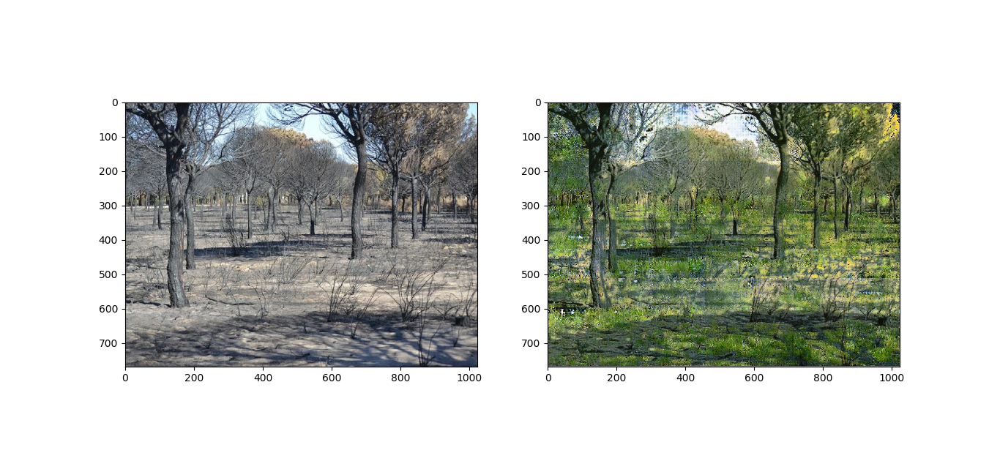
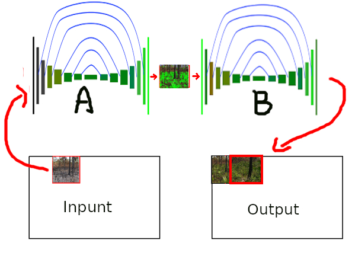
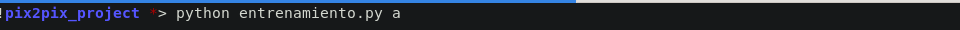
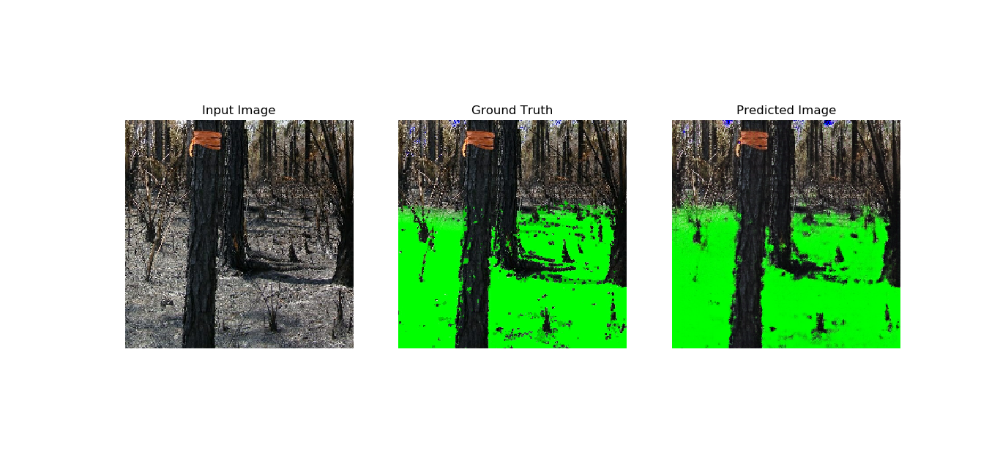
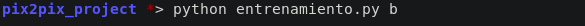
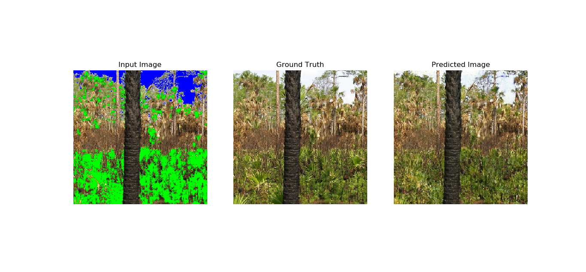

# Green Recovery
_Buenas, En este proyecto lo que se quiere lograr es, dada una imagen de un bósque o una sabana después de un incendio en el que solo quedan cenizas y carbon, generar una imagen en el que se muestre como se vería tras un tiempo de recuperación, con una imagen de salida de 786x1024 utilizando al arquitectura pix2pix._

 
[Pix2pix](https://arxiv.org/pdf/1611.07004.pdf) es una arquitectura de red neuronal en forma de reloj de arena que toma como input una imagen y dá como output otra imagen. En este caso implementada en python.

## 1. ¿Cómo funciona?
Bueno como he mencionado antes nuestro objetivo es generar una imagen de un bosque recuperado de un incendio y que la imagen tenga una resolución de 768x1024.

Por lo cual nos enfrentamos a los siguientes problemas.
#### 1.1. Conseguir el dataset es imposible.
Como nuestro tarea generar una imagen de un bosque verde por lo que necesitamos imagenes de bosques o areas verdes quemadas y sus versiones en las que pasado un tiempo se hayan recuperado.

Para conseguir este dataset se tendria que esperar por un incendio, tomar fotos, esperar a que se recupere y volver a sacar la foto exactamente desde el mismo angulo y en internet tampoco habia este tipo de fotos o almenos no adecuadas para el entrenamiento de la red neuronal.

Por ejemplo:<br>
<br>
<a href="https://www.fws.gov/refuge/Florida_Panther/what_we_do/prescribed_burning.html">Origen de la imagen</a>


Este seria el resultado si lo entrenasemos asi.


Para solucionar este problema hice algo parecido a como el creador de DeepNude resolvió una dificultad similar con el dataset.

El problema se divide en dos sub-problemas:
- Generar una mascara que seleciones la areas quemadas (carbón y ceniza)

- Generar la imagen de salida a partir de las imagenes enmascaradas.


Nuestro dataset se transforma en dos sub-datasets:
- dataset_a -> **input_images_a, output_images_a** -> imagenes de lugares quemados y sus mascaras.
- dataset_a -> **input_images_b, output_images_b** -> imagenes enmascaradas y la salida deseada.

Para facilitar este porceso se utilizó imagenes de muy alta resolucion e imagenes panoramicas para luego recortarlas en varias imagenes pequeñas.


De esta forma no hay necesidad de que el input y el output del problema principal sean iguales.

#### 1.2. Pix2Pix es muy pequeña pero muy densa.
La arquitectura pix2pix genera imagenes de 256x256 y en el problema original las salidas deben de ser de 768x1024. (*se podría usar pix2pixHD pero tardaria mas en entrenarse por su tamaño, ademas mi laptop no soporta ese tamaño de arquitectura, ya con pix2pix a duras penas puede hacer una predicción*).

Pues, la solucion es algo simple, hacemos que todo nuestro modelo recorra la imagen y la procese a trozos armando la imagen resultante con estos mismos.



En la parte del Output cada vez que hay pixeles que se pobreponen al escribir la imagen, para evitar bordes o lineas de corte se opera la media de los pixeles que se sobrepongan.

## 2. Entrenamiento y validacion.
El entrenamiento se hizo el la plataforma Google Colaboratory, puesto que mi PC no da abasto para un modelo de red neuronal tan grande.

Como ya lo mensioné, habia que dividir el problema en do, por lo cual se entrenó dos modelos:
- Modelo_a -> un **generator_a** y un **discriminator_a**, entrenado para marcar las zonas de importancia en nuestras imagenes.
- Modelo_b -> un **generator_b** y un **discriminator_b**, entrenado para plantar vegetación en ahí donde el primer modelo marcó.

Estos modelos habia que entrenarlos por separado, ya que al intentar entrenarlos en simultaneo, daba un error al usar el decorador **@tf.function()** en las funcion 'train_step'.

Se entreno en total, para:
- El Modelo_a.- 400 epocas con 302 de 378 ejemplos, el resto para validación.
- El Modelo_b.- 650 epocas con 418 de 523 ejemplos, el resto para calidación.

Para la validacion, que la funcion esta en el mismo script del entrenamiento, se encuentra una funcion que va a mostrar el resultado de diez imagenes aleatoria del test_dataset procesadas con un modelo seleccionado ejecutando estos comandos.
Para el Modelo_a:



Para el Modelo_b:





Es importante que existan datos en las carpetas **input_image_a/b** y **output_imagea/b**.


## 3. Pre-requisitos
_La aplicacion depende de las siguientes librerias_
```
 - tensorflow 2.0 https://www.tensorflow.org/install
 - numpy          https://numpy.org/
 - matplotlib     https://matplotlib.org/
```
Puede instalar todas estas dependencias mediante el archivo 'requirement.txt'

## 4. Comenzando
_Para usar la aplicacion realize los siguientes pasos._
 - Muevase al directorio de del proyecto.
 - Descargue los modelos entrenados <a href="https://drive.google.com/drive/folders/1ntseSSRH4cYp20bVY1uQ2QJaJLJa62Bs?usp=sharing" target=»_blank»>(click-aquí)</a> y guardelos en una carpeta con el nombre de "**saved_models**".
 - Ejecute la linea la siguiente linea de comando.
 
Donde "test_real_images/image_8.jpg" es el directorio de la imagen que desea transformar.
Esto le mostrar la imagen ingresada con la imagen resultante con la libreria matplotlib y luego almacenara la imagen generada en el directorio "imagenes_generadas", si no existe el directorio, se creará automaticamente.


## Autores

* **Willy Samuel Paz Colque** - *Trabajo total*
